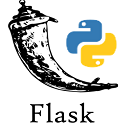
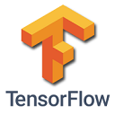

# Hi! Welcome to My Github page :) 👋

## Skills 
#### Progremming
>  
#### Web
> 

#### Deep learning and Machine learning
> 

## Projects
- **Alt+s** Website *(Backend via Flask, Frontend via React)*
  
  *Comming soon*
  
- **Alt+s** Chrome Extension *(Backend via Nodejs, Frontend via HTML and js)*

>> This extension helps programmers to search queries easier and faster directly from *Alt+s*
>> 

