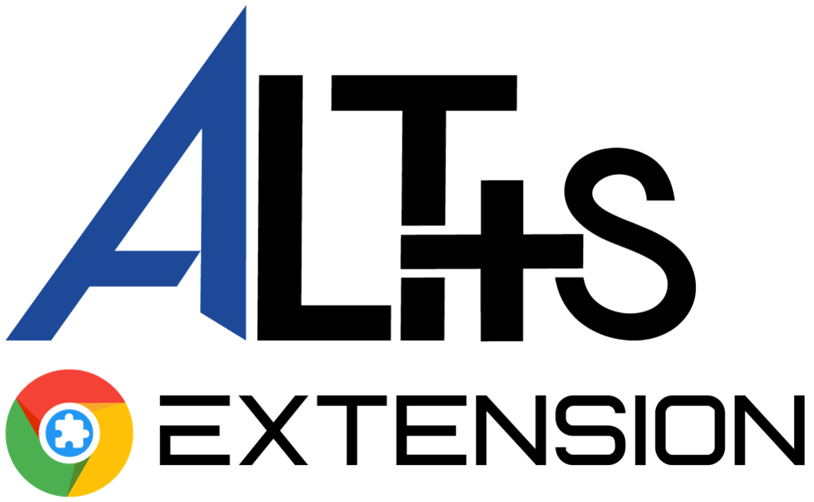

# Hi! Welcome to My Github page :) 👋

## Skills 
#### Progremming
>  
#### Web
> 

#### Deep learning and Machine learning
> 

## Projects
- **Alt+s** Website *(NodeJs, Flask, React)*
>> https://www.altsextension.com
  
  
  
- **Alt+s** Chrome Extension *( Nodejs, jQuery)*

>> This extension helps programmers to search queries easier and faster directly from *Alt+s*
>> 

